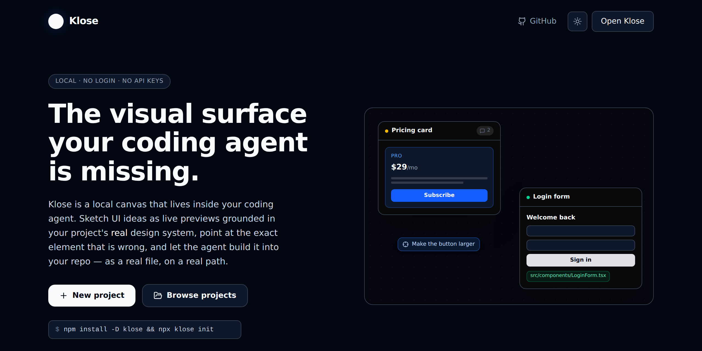
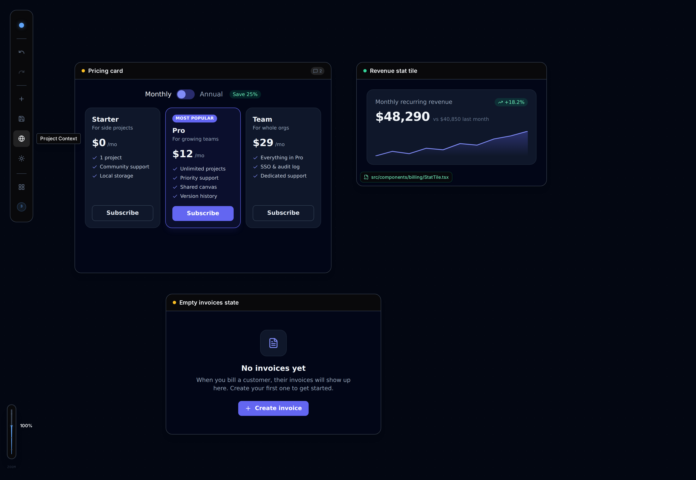
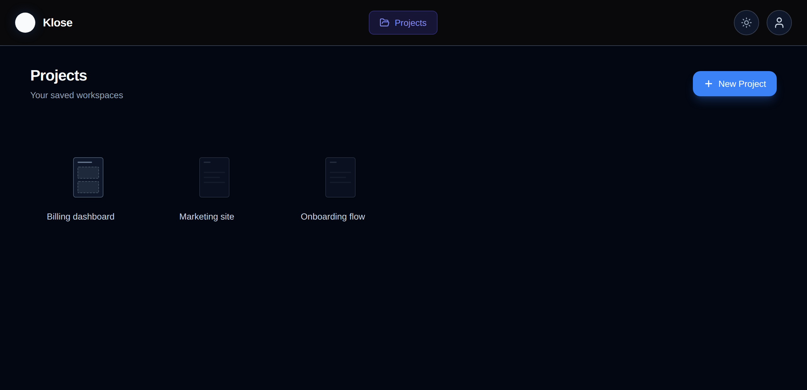
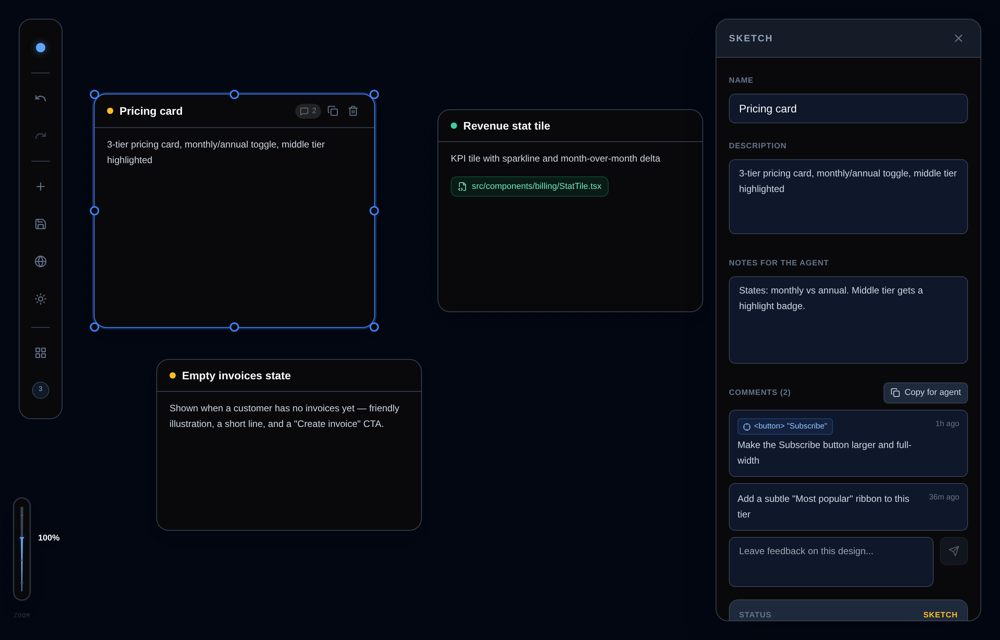
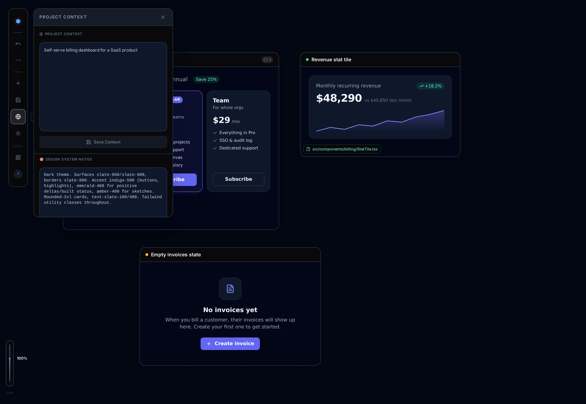
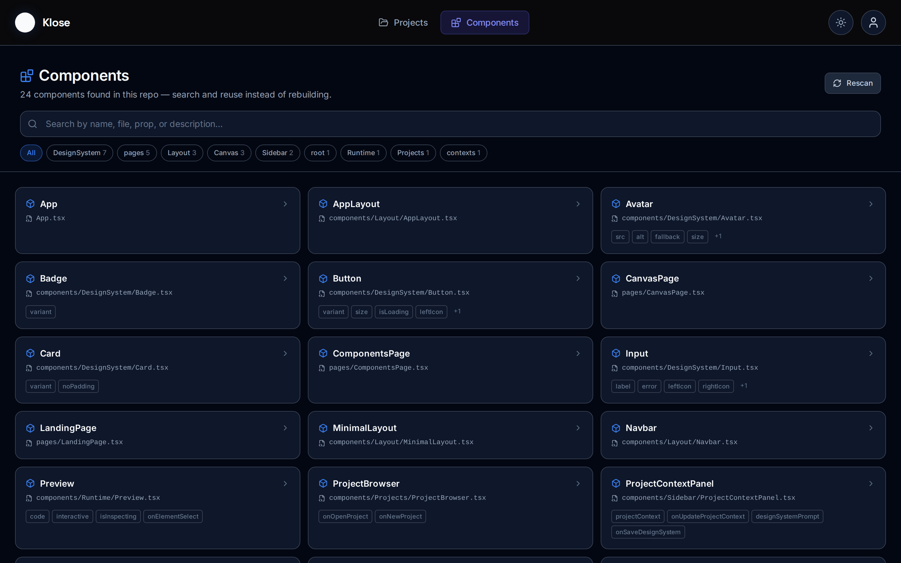
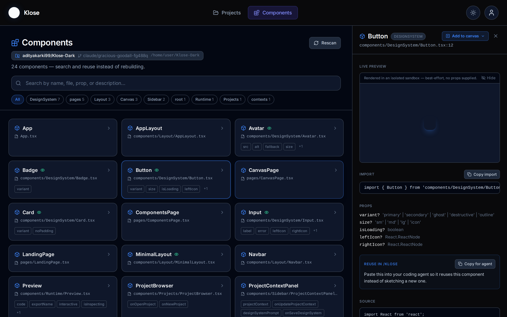

<div align="center">

# Klose

**Design components where you code.**

A local, no-login design canvas that lives inside your coding agent. Sketch UI ideas as live
previews grounded in your project's *real* design system, leave feedback right on them, and let the
agent build them into your repo.

<p>
  
  
  = 18" src="https://img.shields.io/badge/node-%3E%3D18-informational">
</p>



</div>

---

## Table of contents

- [What is Klose?](#what-is-klose)
- [The loop](#the-loop-sketch--preview--comment--build)
- [Install](#install)
- [Guided walkthrough](#guided-walkthrough)
- [Use cases](#use-cases)
- [Features](#features)
- [CLI reference](#cli-reference)
- [How `/klose` works](#how-klose-works)
- [Architecture](#architecture)
- [FAQ & troubleshooting](#faq--troubleshooting)
- [Local development](#local-development-working-on-klose-itself)
- [Contributing](#contributing)
- [License](#license)

---

## What is Klose?

Coding agents are great at *building* UI, but the loop is clumsy: you describe a component in chat,
the agent writes a file, you run the app to see it, you describe a change, repeat. There's no shared
visual surface — no place to *see* an idea, arrange a few of them, and point at exactly what's wrong.

**Klose is that surface.** It installs into any repo as a `/klose` skill for
[Claude Code](https://claude.com/claude-code) and opens a local canvas in your browser where:

- component ideas live as **sketches** — rendered live previews, not just labeled boxes;
- every preview is **grounded in your project's real design system** (your Tailwind config, tokens,
  and existing components), so it looks like *your* app, not a generic template;
- you leave **comments** right on a design — or click a specific element to scope feedback to it —
  and copy that feedback straight back to the agent;
- when you're happy, the agent **builds the real component** into your source tree.

Klose has **no AI model of its own**. It's a visual scratchpad and a place to keep design notes; the
coding agent does the thinking and the building. That's why there's no login, no cloud backend, and
no API keys — everything is a local server and plain JSON files under `.klose/` in your repo.

---

## The loop: Sketch → Preview → Comment → Build

<div align="center">

</div>

| Step | What happens |
| :--- | :--- |
| **1. Ideate** | Run `/klose`. The agent reads your repo's design system, then talks through purpose, states, data, and interactions with you. |
| **2. Preview** | The settled design lands on the canvas as a **live, rendered mockup** — styled to your design system, not a generic default. |
| **3. Comment** | Leave feedback on a sketch, or **point at an exact element** in the preview. One click copies it back to the agent. |
| **4. Build** | On your go-ahead, the agent writes the real component into your source tree and marks the sketch **built**, with the file path. |

The whole loop stays in your editor — no context-switching to a separate design tool, no copy-pasting
between apps, no re-explaining your design system every time.

---

## Install

```bash
npm install -D klose
npx klose init
```

`klose init` drops the `/klose`, `/klose-update`, and `/klose-cleanup` skills into `.claude/skills/`
and creates local project storage at `.klose/` — seeded with a demo sketch so the canvas isn't empty
on your first run. Then, in Claude Code:

```
/klose
```

The skill starts the local server for you. To run it manually:

```bash
npx klose serve --open
```

> **Requirements:** Node.js ≥ 18. Klose runs entirely on your machine — no account, no cloud service,
> no API keys.

Optional flags for `klose init`:

```bash
npx klose init --no-demo          # skip the demo project
npx klose init --wire-claude-md   # add a short note to CLAUDE.md so the agent suggests /klose on its own
```

Later, `npx klose update` upgrades the package and refreshes the installed skill files in one step,
and `npx klose cleanup` clears out sketches already built into real files and empty projects (dry
run by default — pass `--yes` to apply).

---

## Guided walkthrough

A first run, end to end.

### 1. Install and initialize

```bash
npm install -D klose
npx klose init
```

You'll get a `.claude/skills/klose/SKILL.md` (the `/klose` command) and an empty `.klose/projects/`.

### 2. Open Klose and pick a project

Run `/klose` in Claude Code (or `npx klose serve --open`). The home screen explains the loop and lets
you create or open a project. Projects are just workspaces — one per feature, screen, or exploration.

<div align="center">

</div>

### 3. Ideate — and a sketch appears

Tell the agent what you want ("a pricing card for our billing page"). It reads your design system,
asks a couple of focused questions, then writes a **live preview** onto the canvas. Every sketch
carries a status — amber for **sketch** (an idea), green for **built** (a real file exists) — plus
its description and any notes the agent should keep in mind.

### 4. Leave feedback

Select a sketch to open its inspector. Add a comment, or hit **Point to an element** and click a
specific button or heading in the preview to scope your feedback to it. **Copy for agent** formats
everything — including the targeted element — as text you paste straight back into the chat.

<div align="center">

</div>

### 5. Build it for real

When you say "build it," the agent writes the actual component into your repo — following the design
system it read, using your real import paths and conventions — then marks the sketch **built** with
the file path. The sketch on the canvas now points at real code.

---

## Use cases

Klose fits anywhere you'd otherwise jump between chat, a design tool, and your editor. A few concrete
ways people use it:

**Building & iterating**
- **New component from scratch** — "a notification toast with success/error variants." See it before
  it's written; adjust; then build.
- **Redesign an existing component** — drop your current component's look on the canvas, describe the
  new direction, compare side by side, then have the agent restyle the real file.
- **Explore variations** — spin up three takes on the same card (compact / spacious / bordered) as
  separate sketches and pick the winner before any code is written.
- **Iterate on a built component** — a sketch stays linked to its file. Leave a comment, and the
  agent edits the real component and re-previews.

**Whole screens & flows**
- **Prototype a screen** — lay out a header, a stat row, a table, and an empty state as sketches on
  one board to feel the composition before building any of it.
- **Design a multi-step flow** — one sketch per step (sign-up → verify → welcome), arranged left to
  right, so the whole journey is visible at once.
- **Cover the edge states** — empty, loading, error, and success states as their own sketches, so the
  states you usually forget get designed on purpose.

**Design systems & consistency**
- **Onboard a design system** — pin your tokens and conventions in the project's design-system notes;
  every sketch and every build the agent produces respects them.
- **Keep new work on-brand** — because previews are grounded in your real config, "does this match our
  app?" is answered on the canvas, not after the PR.
- **Build a visual reference** — a project full of your team's approved patterns, each a live preview,
  as a living style reference you can point new teammates at.

**Review & collaboration**
- **Element-precise design review** — click the exact button that's too small and comment on *it*,
  instead of writing "the CTA in the pricing card, third one down."
- **Async handoff** — leave a stack of comments on a sketch and hand the "Copy for agent" text to a
  teammate (or your own agent later) to act on.
- **Turn a reference into a component** — describe a screenshot or a site you like; the agent proposes
  a sketch grounded in *your* system, then builds it.

**Responsiveness & polish**
- **Eyeball layouts** — resize a sketch on the canvas to sanity-check how a component holds up at
  different widths before committing to it.
- **Quick "what if"** — try a bolder color or a tighter density as a throwaway sketch; keep it or
  delete it, no code touched.

---

## Features

### Live, grounded previews

Sketches render **real component code** (written by the agent) inside a sandboxed iframe, styled with
your design system — so a preview looks like it belongs in your app. A sketch doesn't *need* code to
be useful, but when it has it, you see the actual thing, interactive.

### Resize, screenshot, and read the code

Drag any frame handle to resize a sketch — edges snap to the grid, **Shift** on a corner keeps the
ratio, **Alt** ignores the grid, and a live readout shows the exact size. The inspector takes exact
width/height values and a few device presets, and the frame's **fit** button snaps it to the size its
preview actually wants.

The camera button saves a 2× PNG of the preview (hold **Alt** to copy it to the clipboard instead) —
taken inside the sandbox, so nothing leaves your machine. The `</>` button flips the frame to the
preview's source: the exact code the sandbox renders, with a copy button.

### Comments & "Copy for agent"

<div align="center">

</div>

Leave freeform feedback on any sketch. **Copy for agent** formats all of a sketch's comments — plus
its name and IDs — into a tidy block you paste back into Claude Code, which reads it as instructions
and clears the ones it handles.

### Element-scoped comments

Click the **target** button on the frame — it sits with the code and camera buttons, where you are
already looking — then click an element in the live preview. Or skip the button: while the comment
box has focus the preview is already targetable, so you can start typing, click the thing you mean,
and carry on. Either way the element lands as a token on the comment's own input line, and the agent
gets the exact tag, text, classes and DOM path — so "make this bigger" is unambiguous.

### Grounded in your design system

<div align="center">

</div>

Each project keeps free-text **design-system notes** and a **project brief**. Combined with the repo
files the agent reads (Tailwind config, token files, existing components), every preview and every
build speaks your design language.

### Find & reuse existing components

<div align="center">

</div>

The **Components** tab indexes your repo's *real* components — every exported `.tsx`/`.jsx` component,
with its props, file path, and doc comment — so you can search what already exists before building
something new. A repo badge (name, branch, path) shows exactly *which* project you're looking at, so a
global install stays unambiguous. Click a component to see its props, a copy-paste import, its full
source, and a **live preview** rendered in an isolated sandbox (best-effort — self-contained components
render; ones that import repo-local modules are flagged instead). **Add to canvas** drops it onto any
project's board as a *built* node linking the real file, so found components sit alongside your sketches.

<div align="center">

</div>

The agent uses the same index. Before it sketches anything, `/klose` runs `npx klose components <query>`
to check for a component it can reuse or extend — and the detail view's **"Copy for agent"** hands it a
ready-made reuse note.

### Local, private, multi-project

No login, no cloud, no keys. Projects are plain JSON under `.klose/projects/` in your repo — commit
them as design history or `.gitignore` them; your call. Manage as many projects as you like.

---

## CLI reference

Everything the `/klose` skill does is a plain CLI call you can run yourself:

```
klose init [--no-demo] [--wire-claude-md]         Install the klose skills and local storage in this repo
klose serve [--port=N] [--open]                   Start the local server (default port 5171)
klose status [--port=N] [--json]                  Check whether the local server is actually running
klose update                                      Upgrade the klose package and refresh installed skill files
klose cleanup [--built] [--empty-projects] [--yes]   Remove built sketches / empty projects (dry run unless --yes)
klose components [query] [--json]                 Search the repo's real components (name, file, props)
klose project list                                List projects
klose project create <name>                       Create a project
klose project get <id>                            Read a project (nodes, comments, notes)
klose project update <id> <json|@file.json>       Merge fields into a project
klose project delete <id>                         Delete a project
klose project add-node <id> <json|@file.json>     Add a sketch node to a project's canvas
klose project update-node <id> <nodeId> <json|@file.json>   Update a sketch node (its code, comments, or mark it built)
klose feedback [--project=<id>]                 Read all pending feedback as structured JSON
```

Any `<json>` argument can instead be `@path/to/file.json` — handy for a sketch's multi-line preview
`code`, which is painful to pass as a shell argument.

---

## How `/klose` works

The `/klose` skill (installed at `.claude/skills/klose/SKILL.md`) tells the agent to:

1. **Ensure the local server is running** and share the canvas URL.
2. **Pick or create a project**, and check its sketches for pending comments to address.
3. **Read your real design system** — Tailwind config, CSS custom properties, existing components —
   rather than inventing generic tokens.
4. **Ideate with you** in chat, using that context.
5. **Write the sketch to the canvas** with live-preview code grounded in step 3.
6. **Build the real component** on confirmation, then mark the sketch built.

It's all driven through the CLI above, so nothing is a black box — you can inspect or script any of it.

---

## Architecture

```
your-repo/
├── .claude/skills/klose/SKILL.md   The /klose skill (copied in by `klose init`)
└── .klose/projects/<id>.json       One JSON file per project — sketches, comments, design notes

klose package
├── bin/klose.js       CLI (init / serve / project *)
├── server/store.js    File-based project storage over .klose/projects/*.json
├── server/http.js     Local HTTP server: REST API + SSE live-refresh + serves the built canvas UI
├── skills/klose/      Source of the skill klose init copies into your repo
└── web/               The canvas UI (React + Vite), built to web/dist and shipped in the package
```

The canvas UI has no AI dependency — it's a projects list and an infinite board of
draggable/resizable sketch nodes, persisted through the local server's REST API. All the "smart"
behavior lives in the coding agent via the `/klose` skill. See
[`docs/ARCHITECTURE.md`](docs/ARCHITECTURE.md) for the full picture.

---

## FAQ & troubleshooting

**Do I need an API key or an account?**
No. Klose runs a local server and stores JSON files. The "intelligence" is your coding agent, which
you're already running.

**Where does my data live?**
In `.klose/projects/*.json` in the repo you ran `klose init` in. Commit it to keep design history, or
add `.klose/` to `.gitignore` to keep it local-only.

**Does it work with agents other than Claude Code?**
The `/klose` skill targets Claude Code, but the `klose` CLI and server are agent-agnostic — any agent
that can run shell commands can drive the canvas via `klose project …`.

**The canvas tab didn't update after the agent added a sketch.**
The server pushes live updates over SSE, but if a change doesn't appear within a second or two, just
refresh the tab.

**A preview shows a spinner or stays blank.**
Live previews use the React, Babel, Tailwind, icon, and chart runtimes bundled with Klose; they do not
need internet access. Rebuild or reinstall Klose if the local runtime fails to load. Repo components
with relative imports are intentionally not executed in isolation: use a self-contained sketch until
safe project-aware bundling is available.

**What does the AGPL license mean for me?**
You can use, study, share, and modify Klose freely. The AGPL's network clause only matters if you host
a *modified* Klose as a service for others — ordinary local use on your own machine carries no extra
obligation. See [LICENSE](LICENSE).

---

## Local development (working on Klose itself)

```bash
npm install
npm run dev      # Vite dev server for the canvas UI, proxies /api to localhost:5171
npm run build    # Builds the canvas UI into web/dist for packaging
npm test         # node --test over test/*.test.js — covers server/, ~1s
```

Tests cover the local server (`server/`): the component scanner, the project
store, and the HTTP routing/status codes. CI runs `npm test` on Node 18, 20 and
22 and `npm run build` on 22 for every pull request against `main`.

**Adding or changing a test — including as an AI agent?** Read
[`test/README.md`](./test/README.md) first. It documents the conventions the
suite relies on (no test dependencies, per-test temp directories, ephemeral
ports, asserting error `code`s rather than message text) and lists the behaviors
that look like bugs but are deliberate.

To exercise the CLI/server against this checkout without publishing:

```bash
npm run build
node bin/klose.js init      # run from inside some other test repo
node bin/klose.js serve --open
```

---

## Contributing

1. Fork the repository
2. Create a feature branch: `git checkout -b feature/my-feature`
3. Commit your changes with a descriptive message
4. Push and open a Pull Request against `main`

CI (`npm test` on Node 18/20/22, `npm run build` on 22) must be green before a PR
merges. Run `npm test` locally first — it takes about a second.

Please keep PRs focused. One feature or fix per PR makes review faster.

---

## License

[GNU AGPL-3.0-or-later](./LICENSE). Klose is free software: you can use, study, share, and modify it
under the terms of the GNU Affero General Public License. Because the AGPL's network clause (section
13) applies, anyone who runs a modified version as a network service must offer that version's source
to its users. Klose runs as a local server on your own machine, so ordinary local use carries no
extra obligation — the clause matters only if you host a modified Klose for others.
